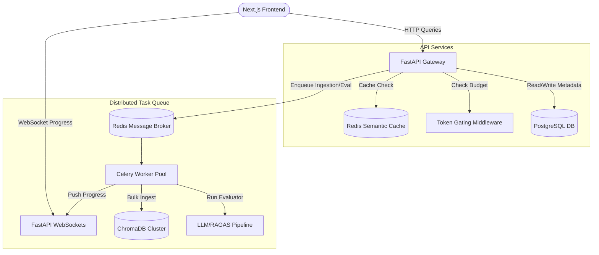

# 🚀 Enterprise RAG Studio - Migration & Hardening Plan

This plan outlines the systematic path to upgrade the existing prototype to an enterprise-ready, production-grade distributed architecture.

---

## 🗺️ Architectural Upgrades Overview



---

## 📅 Stage 1: Redis Broker & Celery Worker Setup

### 1.1 Create Celery App Singleton
Introduce [celery_app.py](file:///home/creator/Desktop/ExcellenceTechnology/06.Rag/backend/app/core/celery_app.py) to configure Celery:
```python
from celery import Celery
from app.config import settings

celery_app = Celery(
    "rag_tasks",
    broker=settings.REDIS_URL,
    backend=settings.REDIS_URL,
    include=["app.tasks.ingestion", "app.tasks.evaluation"]
)

celery_app.conf.update(
    task_serializer="json",
    accept_content=["json"],
    result_serializer="json",
    timezone="UTC",
    enable_utc=True,
    task_track_started=True,
)
```

### 1.2 Define Celery Tasks
* Move ingestion from `documents.py` to `app/tasks/ingestion.py`.
* Move batch evaluations from `evaluation.py` to `app/tasks/evaluation.py`.

---

## 🗄️ Stage 2: PostgreSQL & Quota Schema Migration

### 2.1 Database Router Upgrade
Update [database.py](file:///home/creator/Desktop/ExcellenceTechnology/06.Rag/backend/app/database/database.py) to use SQLAlchemy with PostgreSQL connection pool bindings:
```python
from sqlalchemy import create_engine
from sqlalchemy.orm import sessionmaker, declarative_base

Base = declarative_base()
engine = create_engine(settings.DATABASE_URL, pool_size=20, max_overflow=10)
SessionLocal = sessionmaker(autocommit=False, autoflush=False, bind=engine)
```

### 2.2 Billing & Quota Model
Introduce a `users` table to track tokens and cost thresholds:
```sql
CREATE TABLE users (
    id VARCHAR(255) PRIMARY KEY,
    username VARCHAR(100) NOT NULL,
    daily_token_limit INTEGER DEFAULT 50000,
    tokens_consumed INTEGER DEFAULT 0,
    last_reset_date DATE DEFAULT CURRENT_DATE
);
```

---

## 🛡️ Stage 3: Token Gating & Budget Middleware

### 3.1 Gating Middleware
Introduce [middleware.py](file:///home/creator/Desktop/ExcellenceTechnology/06.Rag/backend/app/core/middleware.py) to intercept query and generation requests:
```python
from fastapi import Request, HTTPException
from starlette.middleware.base import BaseHTTPMiddleware

class TokenGatingMiddleware(BaseHTTPMiddleware):
    async def dispatch(self, request: Request, call_next):
        # 1. Resolve user ID from headers/session
        # 2. Check tokens_consumed vs daily_token_limit
        # 3. Raise 402 Payment Required if limit exceeded
        return await call_next(request)
```

---

## ⚡ Stage 4: Redis Semantic Cache Layer

### 4.1 Vector Cache Engine
Create [semantic_cache.py](file:///home/creator/Desktop/ExcellenceTechnology/06.Rag/backend/app/services/semantic_cache.py) using the Redis Vector Search interface to index queries:
```python
import redis
from app.embeddings.sentence_transformer import get_embedding_model

class RedisSemanticCache:
    def __init__(self):
        self.client = redis.Redis.from_url(settings.REDIS_URL)
        
    def get(self, query: str) -> Optional[str]:
        # 1. Embed query
        # 2. Run vector similarity search inside Redis cache index
        # 3. If cosine similarity >= 0.95, return cached answer
        return None
```

---

## 🔌 Stage 5: WebSocket Connection Manager

### 5.1 Real-time Broadcast Endpoint
Introduce [ws.py](file:///home/creator/Desktop/ExcellenceTechnology/06.Rag/backend/app/routers/ws.py) to host connection scopes:
```python
from fastapi import APIRouter, WebSocket, WebSocketDisconnect

router = APIRouter(prefix="/ws", tags=["websockets"])

class ConnectionManager:
    def __init__(self):
        self.active_connections: dict[str, list[WebSocket]] = {}
        
    async def connect(self, client_id: str, websocket: WebSocket):
        await websocket.accept()
        self.active_connections.setdefault(client_id, []).append(websocket)
        
    def disconnect(self, client_id: str, websocket: WebSocket):
        self.active_connections[client_id].remove(websocket)
```
Change Next.js views to initialize `new WebSocket('ws://localhost:8000/api/ws/jobs/...')` to display live task progress bars.
