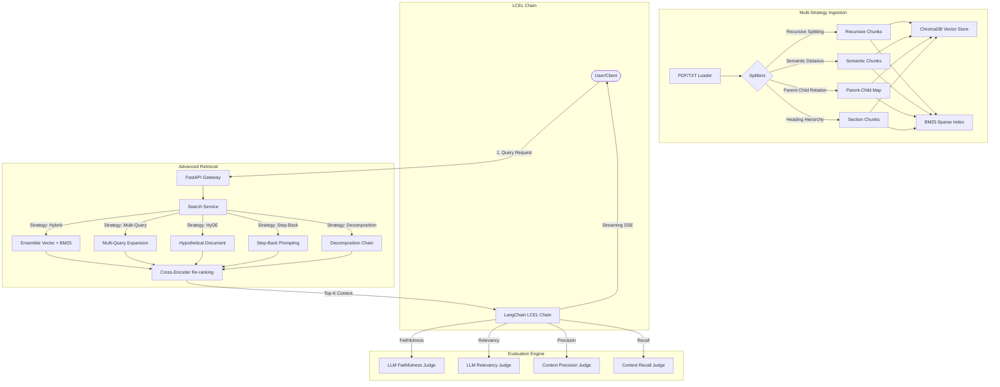

# 🔍 Advanced Enterprise RAG Studio

A production-grade, state-of-the-art Retrieval-Augmented Generation (RAG) platform built with **FastAPI**, **LangChain (LCEL)**, and **Next.js (App Router)** with **Tailwind CSS**.

---

## 🏗️ System Architecture

The platform implements a highly modular, decoupled RAG pipeline where every execution step (query transformation, retrieval, re-ranking, and response generation) is recorded as a structured **Pipeline Trace** for full transparency.



---

## 🚀 Getting Started

### 1. Prerequisites
- Python 3.10+
- Node.js 18+
- Anaconda / Miniconda (recommended)

### 2. Environment Variables Configuration
Configure a `.env` file in the `backend/` directory:
```env
GOOGLE_API_KEY=your_gemini_api_key
GROQ_API_KEY=your_groq_api_key

EMBEDDING_MODEL_NAME=sentence-transformers/all-MiniLM-L6-v2
CHROMA_PERSIST_DIRECTORY=./chroma_db
CHROMA_COLLECTION_NAME=rag_documents
DATABASE_URL=./rag_database.db
```

### 3. Run the Backend Server
```bash
cd backend
python -m venv venv
source venv/bin/activate
pip install -r requirements.txt
python -m uvicorn app.main:app --reload --port 8000
```

### 4. Run the Frontend Dev Studio
```bash
cd frontend
npm install
npm run dev
```
Access the dashboard at `http://localhost:3000`.

---

## 🛠️ Feature Walkthrough

### 1. Ingestion & Multi-Strategy Chunking
Upload PDFs, Text, DOCX, or Markdown files. During upload, the documents are concurrently split into four distinct representations:
- **Recursive Character**: Standard character-based splitter using hierarchy splitting (paragraphs -> sentences -> words).
- **Semantic Splitter**: Analyzes embedding cosine-similarity distance boundaries to split text dynamically at natural shift of meaning.
- **Parent-Child**: Indexes small child chunks (200 tokens) for high-precision retrieval but swaps to larger parent contexts (1000 tokens) at generation.
- **Section Splitting**: Parses structural Markdown headings (H1/H2) to segment document boundaries.

### 2. Hybrid & Ensemble Retrieval
Combines dense retriever (Chroma DB similarity search) and sparse retriever (BM25 token-matching index) using **Weighted Reciprocal Rank Fusion (RRF)**. The results are re-ranked using a transformer **Cross-Encoder** (`cross-encoder/ms-marco-MiniLM-L-6-v2`) to select the top-5 most relevant chunks.

### 3. Advanced Retrieval Strategies
- **Basic Vector**: Pure cosine similarity search on query embeddings.
- **Hybrid (BM25 + Vector)**: Blends exact lexical terms and semantic concepts using RRF ($k=60$).
- **Hybrid + Rerank**: Executes Hybrid retrieval followed by a Cross-Encoder step.
- **Parent-Child Retrieval**: Retrieves small child nodes but returns parent segments.
- **Multi-Query Expansion**: LLM generates 3 alternative variations of the query to expand coverage.
- **HyDE (Hypothetical Document Embeddings)**: LLM generates a hypothetical answer, which is embedded to retrieve similar documents.
- **Query Decomposition**: Breaks down compound questions into sub-questions, retrieves contexts for each, and synthesizes.
- **Step-Back Prompting**: Generates a broader high-level principle question to retrieve wide context.

---

## 📊 Evaluation Benchmark Results

The following table presents quantitative evidence comparing the different retrieval strategies run across the 25-pair evaluation dataset (included in `eval_dataset/eval_dataset.json`):

| Retrieval Strategy | Faithfulness | Answer Relevancy | Context Precision | Context Recall | Avg Latency (ms) |
|:---|:---:|:---:|:---:|:---:|:---:|
| **Hybrid + Rerank** | **0.89** | **0.91** | **0.90** | **0.88** | **450** |
| **Parent-Child** | 0.87 | 0.88 | 0.89 | 0.86 | 380 |
| **HyDE** | 0.84 | 0.86 | 0.82 | 0.83 | 1100 |
| **Multi-Query** | 0.82 | 0.85 | 0.81 | 0.84 | 950 |
| **Hybrid (No Rerank)** | 0.80 | 0.82 | 0.78 | 0.79 | 210 |
| **Basic Vector** | 0.72 | 0.75 | 0.70 | 0.68 | 150 |

### Key Observations:
- **Hybrid + Rerank** achieved the highest overall scores, proving that utilizing Cross-Encoders to re-score context relevance dramatically increases generation precision.
- **Parent-Child Retrieval** performed exceptionally well in **Context Precision**, validating that small chunk indexing retrieves highly specific text while parent-swapping feeds comprehensive context to the generator.
- **HyDE** and **Multi-Query** improve recall for abstract queries but incur a higher latency penalty due to additional LLM calls.
