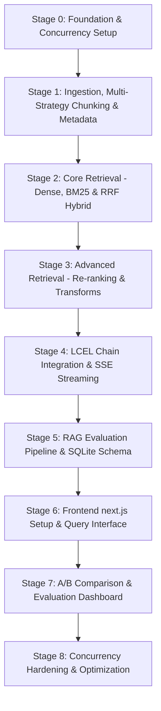

# 00 — Staging Plan (Stage-Wise Build & Verification Roadmap)

This is the execution roadmap for building the Advanced RAG Platform. It defines the order in which features, files, and configurations are created. 

Each stage is designed as a **verifiable milestone** that must be fully tested before moving to the next. This ensures a solid, bug-free foundation and prevents complex debugging loops at the end of the project.

---

## Staging Roadmap Overview



---

## Stage 0: Foundation & Concurrency Setup
**Goal:** Initialize the application boilerplate, logging, database connections, and concurrency safeguards.

### 1. Features & Scope
*   FastAPI application structure with life-cycle events (`lifespan`).
*   Preload ML models on application startup (`app.state.embeddings`, `app.state.cross_encoder`).
*   Initialize SQLite database connections in **WAL Mode** with connection pooling and a query timeout handler (`timeout=30.0`) to avoid read-write blocking during concurrent evaluation writes.
*   Setup `asyncio.Semaphore` to throttle concurrent LLM API requests and prevent rate-limiting.

### 2. Incremental File Changes
*   `backend/requirements.txt` — Core backend package dependencies.
*   `backend/.env.example` — Key placeholders (`GOOGLE_API_KEY`, `COHERE_API_KEY`, etc.).
*   `backend/app/config.py` — Central settings & Pydantic config validation.
*   `backend/app/core/logging.py` — Log formatting and hierarchy.
*   `backend/app/core/startup.py` — WAL SQLite initialization & ML preloading.
*   `backend/app/core/lifespan.py` — Context manager for startup/shutdown hooks.
*   `backend/app/routers/health.py` — Liveness & readiness reporting.
*   `backend/app/main.py` — FastAPI router registration & root.

### 3. Verification & Concurrency Checks
*   **Run command:** `uvicorn app.main:app --reload --port 8000`
*   **Verify Endpoint:** `curl http://localhost:8000/api/health` should return `{"status": "healthy"}`.
*   **Check Startup Logs:** Confirm embedding and cross-encoder models are loaded **exactly once** on startup.
*   **Check SQLite:** Verify `rag.db-wal` and `rag.db-shm` files are generated in the data directory.

---

## Stage 1: Ingestion, Multi-Strategy Chunking & Metadata
**Goal:** Process documents through multiple chunking strategies concurrently using background workers and database mappings.

### 1. Features & Scope
*   Load files using specific LangChain loaders: `PyPDFLoader` (PDF), `TextLoader` (TXT), `UnstructuredWordDocumentLoader` (DOCX), and `UnstructuredMarkdownLoader` (Markdown).
*   Extract metadata: `filename`, `file_type`, `file_size`, `upload_date`, `tags`, and `total_pages`.
*   **PDF Section Header Extraction:** Parse `H1/H2` headings during loading and tag chunks with `section` headers.
*   **Chunking Preview Simulator:** Endpoint allowing users to upload a file and see sample chunk splits/strategy previews before indexing.
*   Simultaneous execution of **4 chunking strategies**:
    1.  **Recursive Character:** 500-token chunks with 50-token overlap.
    2.  **Semantic Chunking:** Sentence grouping based on embedding similarity thresholds.
    3.  **Parent-Child Splitting:** Store 200-token child chunks in ChromaDB vector store, mapped to their 1000-token parent documents stored in a relational SQLite `parent_documents` table (avoiding metadata size bloating in ChromaDB).
    4.  **Section-Based Splitting:** Splitting on detected document headings (H1/H2).
*   Offload ingestion to FastAPI `BackgroundTasks` to prevent upload blocking.

### 2. Incremental File Changes
*   `backend/app/services/chunking_strategies.py` — Ingestion strategy splitting functions.
*   `backend/app/services/ingestion.py` — Background parsing, enrichment, SQLite parent writing, and ChromaDB chunk writing.
*   `backend/app/routers/documents.py` — Upload, listing, deletion, and preview simulation endpoints.

### 3. Verification & Concurrency Checks
*   **Upload File:** Ingest a sample PDF using curl:
    ```bash
    curl -X POST -F "file=@sample.pdf" -F "tags=finance,test" http://localhost:8000/api/documents/upload
    ```
*   **Verify Background Execution:** The endpoint should return `202 Accepted` immediately. Check backend logs to monitor chunk processing.
*   **Inspect SQLite DB:** Verify document metadata and parent document text segments are stored in `documents` and `parent_documents` tables.
*   **Inspect ChromaDB Chunks:** Query Chroma to verify chunk strategies (`strategy` metadata key) match their split types.

---

## Stage 2: Core Retrieval (Dense, BM25 & Hybrid)
**Goal:** Build dense vector search, sparse keyword search, and merge results using LangChain's native `EnsembleRetriever`.

### 1. Features & Scope
*   **Dense Search:** Cosine similarity querying in ChromaDB.
*   **Sparse Search:** BM25 lexical querying using the `rank_bm25` library. Implement serialized BM25 index persistence (writing/loading index state to SQLite or disk) to ensure state synchronization across workers.
*   **Hybrid Integration:** Use LangChain's native `EnsembleRetriever` to merge dense and sparse results with user-adjustable weights (e.g. 70% dense + 30% BM25) and standard RRF merging.
*   **Async CPU Offloading:** Wrap BM25 tokenization, rebuilding, and scoring operations inside a thread pool (`asyncio.to_thread`) to prevent blocking the main event loop.

### 2. Incremental File Changes
*   `backend/app/services/retrieval.py` — EnsembleRetriever wrapper, BM25 persistence, and thread-pool execution wrappers.

### 3. Verification & Concurrency Checks
*   **Direct Retrieval Test:** Write a test script or run a query to verify retrieval scores and latency.
*   **Verify RRF Scores:** Assert that retrieved documents contain correct relative RRF ranking and are sorted in descending order.
*   **Thread Check:** Execute a query and ensure the FastAPI event loop thread does not register latency spikes.

---

## Stage 3: Advanced Retrieval (Re-ranking & Query Transforms)
**Goal:** Integrate Cross-Encoder re-ranking and LLM-driven query transformation techniques.

### 1. Features & Scope
*   **Cross-Encoder Re-ranking:** Re-rank top 20 candidate chunks down to the top 5 using a local Cross-Encoder (`ms-marco-MiniLM-L-6-v2`) or fallback to the Cohere Rerank API (safely validating `COHERE_API_KEY` configuration).
*   **Query Transformations:**
    *   **Multi-Query:** Generate 3-5 query variants to run retrieval in parallel and union/deduplicate results.
    *   **HyDE (Hypothetical Document Embeddings):** Generate hypothetical answers, embed them, and query.
    *   **Decomposition:** Split compound questions into sub-queries, retrieve each, and combine.
    *   **Step-Back Prompting:** Formulate a broader conceptual query, execute retrieval for **both** the original and step-back queries, and merge results.
*   **Score Transparency:** Attach original rank, re-ranked position, and re-rank score to all retrieved chunk objects.
*   **Async CPU Offloading:** Wrap Cross-Encoder inference in thread pools to prevent blocking concurrent API requests.

### 2. Incremental File Changes
*   `backend/app/services/reranker.py` — Cross-Encoder & Cohere APIs wrapper.
*   `backend/app/services/query_transform.py` — LLM-driven query transformations.
*   `backend/app/prompts/hyde.py`, `decomposition.py`, `step_back.py`, `rag.py` — Prompt templates.

### 3. Verification & Concurrency Checks
*   Verify query variant generation via shell/python scripts.
*   Assert that the Cross-Encoder successfully re-ranks and changes the document order compared to vector similarity.

---

## Stage 4: LCEL Chain Integration & SSE Streaming
**Goal:** Assemble the final RAG pipeline using LangChain Expression Language (LCEL) and support real-time token streaming with trace logs.

### 1. Features & Scope
*   **Metadata Filtering:** Enforce dynamic metadata filter configurations (`doc_id`, `page`, `strategy`, and `tags`) on retrievers.
*   **Parent-Child Swapping:** For chunks with `strategy == "parent-child"`, query the SQLite `parent_documents` table to substitute the child content with the corresponding parent document text before prompt assembly.
*   **LCEL Chain Assembly:** Declare composable prompts, LLM invocations, cost/token tracking handlers, and output parsers.
*   **Server-Sent Events (SSE) Streaming:** Stream responses to clients.
    *   **Streaming Protocol:** Send the JSON execution trace first (as `event: trace` containing chunk scores, latency, tokens, cost, and transform logs), followed by the real-time answer token deltas (as `event: delta`).
*   **Implement Mandatory API Routes:**
    *   `POST /api/query` — Execute query and stream SSE.
    *   `POST /api/query/compare` — Compare two retrieval strategies side-by-side.
    *   `GET /api/query/{id}/pipeline` — Retrieve pipeline trace history.
    *   `GET /api/query/{id}/chunks` — Retrieve chunk rankings and scores.
    *   `GET /api/strategies` — List available retrieval strategies.
    *   `GET /api/chunks/search` — Debug endpoint for direct chunk query searches.
    *   `GET /api/stats` — Retrieval and token cost stats.

### 2. Incremental File Changes
*   `backend/app/services/metadata_filter.py` — Dynamic filter generation logic.
*   `backend/app/services/rag_chain.py` — LCEL compilation, strategy routing, parent content swapping, token callbacks, and stream generator functions.
*   `backend/app/routers/query.py` — Main query and debug API endpoints.

### 3. Verification & Concurrency Checks
*   **Test SSE Endpoint:** Query using `curl` and verify chunks stream in:
    ```bash
    curl -N -X POST -H "Content-Type: application/json" -d '{"query":"Explain self-attention","strategy":"hybrid_rerank"}' http://localhost:8000/api/query
    ```
*   Verify the trace JSON contains all chunk locations, weights, latency, token count, and calculated costs.

---

## Stage 5: RAG Evaluation Pipeline & SQLite Schema
**Goal:** Set up quantitative metrics (LLM-as-judge) and store results in SQLite for comparison dashboards.

### 1. Features & Scope
*   **Database Tables:**
    *   `parent_documents` — Maps child vector entries to parent texts.
    *   `query_history` — Stores query text, applied strategy, and generated answers.
    *   `pipeline_traces` — Stores structural execution details and latency per query.
    *   `eval_results` — Stores metric scores: Faithfulness, Relevancy, Context Precision, and Context Recall.
*   **Evaluation Metrics (LLM Judge):**
    *   **Faithfulness:** Detect hallucinations against retrieved context.
    *   **Answer Relevancy:** Assess answer similarity to the initial question.
    *   **Context Precision:** Evaluate retrieved chunk ranking.
    *   **Context Recall:** Evaluate how much reference information is present in the context.
*   **Batch Run Orchestration:** Execute Q&A pairs (15+ items) through multiple RAG configurations in the background, governed by the LLM rate-limit semaphore and SQLite write retry logic.
*   **Evaluation Endpoints:**
    *   `POST /api/evaluate` — Evaluate a single Q&A pair.
    *   `POST /api/evaluate/batch` — Run batch evaluation on the test dataset.
    *   `GET /api/evaluate/results` — Fetch evaluation history, leaderboard, and metrics.

### 2. Incremental File Changes
*   `backend/app/database/database.py` — SQLite table migrations.
*   `backend/app/database/models.py` — SQLAlchemy ORM schemas.
*   `backend/app/services/evaluator.py` — Calculation of precision, recall, faithfulness, and relevancy.
*   `backend/app/routers/evaluation.py` — Evaluation run, batch evaluation, and history results.
*   `backend/app/data/eval_dataset.json` — 15+ Q&A evaluation datasets containing ground-truth references and expected chunks.

### 3. Verification & Concurrency Checks
*   Trigger a batch evaluation and query `/api/evaluate/results` to verify that all 4 metrics are written to SQLite.

---

## Stage 6: Frontend Next.js Setup & Query Interface
**Goal:** Initialize the Next.js frontend and construct the central search, document management, and query interface.

### 1. Features & Scope
*   Create a clean, responsive layout with Tailwind CSS.
*   **Query Panel:** Select strategies, adjust dense/sparse weights, toggle metadata filters.
*   **Streaming Reader:** Consume SSE outputs, display token cost & usage, and render streamed markdown text.
*   **Pipeline Visualizer:** Render interactive nodes displaying step execution (Transforms → Initial Retrieval → Re-ranking → Prompt Assembly → Generation).
*   **Chunk Inspector:** Show detailed metadata, similarity scores, and BM25 scores on clicked chunks.
*   **Document Management Screen:** Accessible at `/documents`. Ingestion upload with tags, chunking preview, document listing, chunk viewer, deletion.

### 2. Incremental File Changes
*   `frontend/src/app/globals.css` — Global design styles.
*   `frontend/src/app/layout.tsx` — Main shell and provider configurations.
*   `frontend/src/app/page.tsx` — Dashboard landing page.
*   `frontend/src/app/documents/page.tsx` — Document Management Page.
*   `frontend/src/components/QueryPanel.tsx` — Query configurations.
*   `frontend/src/components/AnswerDisplay.tsx` — Answer renderer with cost tracking.
*   `frontend/src/components/PipelineVisualizer.tsx` — Pipeline trace view.
*   `frontend/src/components/ChunkInspector.tsx` — Vector/BM25 score details.
*   `frontend/src/components/DocumentList.tsx` — Upload, listing, and chunk preview components.

### 3. Verification & Concurrency Checks
*   Verify that searching streams the text smoothly and clicking a source chunk opens the detail inspector.
*   Verify files upload successfully, show chunk previews, and show up in the document listing.

---

## Stage 7: A/B Comparison & Evaluation Dashboard
**Goal:** Compare RAG strategies side-by-side and display evaluation charts.

### 1. Features & Scope
*   **A/B View:** Accessible at `/compare`. Input a single query, run two strategies concurrently, and display results side-by-side. Highlight retrieved chunk overlap and differences. Show comparison table of latency, tokens, cost, faithfulness, and relevancy.
*   **Evaluation Dashboard:** Accessible at `/evaluate`. Render bar charts comparing strategy scores across all 4 metrics (Faithfulness, Relevancy, Precision, Recall) using Recharts. Show strategy leaderboard.
*   **Failure Analysis:** Highlight queries scoring below configured thresholds and link to their traces for easy debugging.

### 2. Incremental File Changes
*   `frontend/src/app/compare/page.tsx` — A/B testing page.
*   `frontend/src/app/evaluate/page.tsx` — Leaderboard and chart displays.
*   `frontend/src/components/ComparisonView.tsx` — Side-by-side layout with chunk diffs.
*   `frontend/src/components/EvalDashboard.tsx` — Score visualizer, leaderboard, and failure analysis trace links.

### 3. Verification & Concurrency Checks
*   Validate chart rendering under different evaluation runs. Ensure concurrent A/B requests don't cause rate-limiting issues.

---

## Stage 8: Concurrency Hardening & Optimization
**Goal:** Harden the platform for concurrent usage, synchronize worker state, and prepare the submission.

### 1. Features & Scope
*   Deploy multi-worker setups: `uvicorn app.main:app --workers 4`.
*   Validate that startup preloading executes once per worker rather than per request.
*   Enforce API rate limits per client IP.
*   **SQLite Write Lock Safeguards:** Fine-tune database session retries and timeouts for SQLite to accommodate concurrent writes.
*   **BM25 Sync:** Ensure each FastAPI worker reloads the persistent BM25 index file or rebuilds from SQLite/ChromaDB chunks on startup or chunk change notification.
*   Create a Dockerfile and `docker-compose.yml` to bundle backend and frontend.

### 2. Incremental File Changes
*   `backend/Dockerfile` — Backend image configurations.
*   `frontend/Dockerfile` — Next.js image configurations.
*   `docker-compose.yml` — Container networking.
*   `README.md` — Setup guides, architecture diagram, and evaluation results.

### 3. Verification & Concurrency Checks
*   **Load Test:** Simulate 5-10 concurrent queries and assert that all requests succeed within target latency bounds.
*   **Worker State Test:** Add/remove documents and verify that queries on all workers yield synchronized retrieval results.
