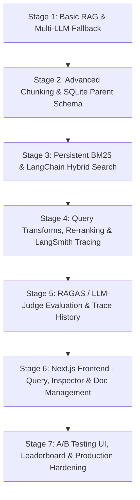

# Progressive Stage Plan: 7-Stage Build & Verification Roadmap

This is the progressive execution roadmap for building the Advanced RAG Platform. It is divided into exactly **7 sequential stages**. Each stage includes specific implementation requirements and strict testing/verification procedures. 

By building a basic functional pipeline first (Stage 1) and progressively layer-adding advanced features, evaluation metrics, and tracing (LangSmith), we ensure continuous verification and robust error isolation.

---

## Concurrency Target

| Phase | Stages | Target Users | Infrastructure |
|-------|--------|--------------|----------------|
| **Assignment** | Stage 0-7 | 5-10 concurrent | SQLite + ChromaDB + Local |
| **Production** | Post-assignment | 1000+ concurrent | PostgreSQL + Redis + Cloud |

**Note:** Stages 0-7 are designed for 5-10 concurrent users (assignment/demo scope). After assignment completion, scaling modifications will be applied for 1000+ users. See `Must-Remember/03.Scaling-Guide.md` for production scaling requirements.

---

## Staging Overview

---

## Stage 1: Basic RAG & Multi-LLM Fallback (Nvidia -> Groq -> Gemini)
**Goal:** Initialize backend boilerplate, database WAL mode, implement a resilient fallback LLM chain, and construct a functional RAG pipeline using simple recursive splitting.

### 1. Requirements & Scope
*   **Boilerplate & Config:** Setup FastAPI workspace with central configurations (`backend/app/config.py`) loading environmental keys (`GOOGLE_API_KEY`, `GROQ_API_KEY`, `NVIDIA_API_KEY`, etc.).
*   **Lifespan & DB WAL Mode:** Initialize SQLite connection at startup (`backend/app/core/startup.py`) using **WAL (Write-Ahead Logging) mode** with a pooled structure and connection timeout set to `30.0` seconds. Create initial database schema for document tracking.
*   **Embedding Preloading:** Preload local embedding model (`sentence-transformers/all-MiniLM-L6-v2`) on startup and attach it to the application state (`app.state.embeddings`).
*   **LLM Fallback Strategy Chain:** Implement a fallback chain using LangChain. The chain must attempt LLM queries in this priority order:
    1.  **Nvidia NIM API** (Primary LLM model)
    2.  **Groq API** (First fallback LLM on Nvidia timeout or rate limit)
    3.  **Gemini API** (Final fallback LLM)
    *   Protect the LLM invocation with an `asyncio.Semaphore` (throttler) configured to restrict concurrent LLM request bursts.
*   **Basic Ingestion Loader:** Build document parsing using LangChain loaders:
    *   `PyPDFLoader` (PDF)
    *   `TextLoader` (TXT)
    *   `UnstructuredWordDocumentLoader` (DOCX)
    *   `UnstructuredMarkdownLoader` (Markdown)
*   **Basic Chunking Strategy:** Process documents using basic `RecursiveCharacterTextSplitter` (chunk size 500 tokens, 50-token overlap). Store chunks in ChromaDB vector database with `strategy='recursive'` metadata.
*   **Basic Vector Retrieval:** Query ChromaDB using vector cosine similarity.
*   **Endpoints:**
    *   `GET /api/health` — Returns application status and loaded state.
    *   `POST /api/documents/upload` — Ingests a document using basic recursive splitting.
    *   `GET /api/documents` — Lists ingested documents.
    *   `DELETE /api/documents/{id}` — Deletes document from ChromaDB and SQLite metadata.
    *   `POST /api/query` — Basic query endpoint yielding RAG answer (non-streaming, basic vector retrieval, fallback LLM chain).

### 2. Files
*   `backend/requirements.txt`
*   `backend/.env.example`
*   `backend/app/config.py`
*   `backend/app/core/logging.py`
*   `backend/app/core/startup.py`
*   `backend/app/core/lifespan.py`
*   `backend/app/main.py`
*   `backend/app/routers/health.py`
*   `backend/app/routers/documents.py` (Basic upload/list/delete)
*   `backend/app/routers/query.py` (Basic query)
*   `backend/app/services/ingestion.py` (Basic loading/splitting)
*   `backend/app/services/retrieval.py` (Basic Chroma search)
*   `backend/app/services/rag_chain.py` (Basic fallback LLM chain)

### 3. Verification & Testing Procedures
1.  **Readiness Check:** Run `uvicorn app.main:app --port 8000` and assert that `curl http://localhost:8000/api/health` yields a healthy response. Check console logs to ensure the embedding model is loaded.
2.  **Basic Ingestion Test:** Ingest a small text file and a small PDF file using `curl -X POST -F "file=@test.txt" http://localhost:8000/api/documents/upload`. Verify response Code `202` or `200` and check database records.
3.  **LLM Fallback Verification:** 
    *   Execute a query to `/api/query`. Confirm it uses Nvidia NIM.
    *   Simulate a failure (e.g. inject an invalid Nvidia API key temporarily). Assert that the logs capture a warning and that the chain successfully falls back to Groq.
    *   Simulate a Groq failure (invalid key). Assert that the query falls back to Gemini and returns a valid response.

---

## Stage 2: Advanced Multi-Strategy Chunking & SQLite Parent Schema
**Goal:** Implement the remaining three chunking strategies and set up relational SQLite schemas to support parent-child segment storage without vector metadata bloating.

### 1. Requirements & Scope
*   **Metadata Enrichment:** Extract: `filename`, `file_type`, `file_size`, `upload_date`, `tags`, `total_pages`. Parse H1/H2 header hierarchies for PDFs and tag matching sections.
*   **Four Chunking Strategies (Run simultaneously on ingestion):**
    1.  **Recursive Character Splitter:** (Implemented in Stage 1).
    2.  **Semantic Chunking:** LangChain experimental `SemanticChunker`. Computes similarity distance thresholds between adjacent sentences to keep coherent ideas grouped.
    3.  **Parent-Child Splitting:** Create child chunks (200 tokens) for ChromaDB vector embeddings. Map each to its 1000-token parent document. Save the parent document contents into the SQLite `parent_documents` database table to keep the Chroma database payload lightweight.
    4.  **Section-Based Splitting:** Slice documents purely by detected headings (H1/H2).
*   **Parent-Child Swapping Flow:** Extend retrieval logic to intercept chunks. If the retrieved chunk's strategy metadata is `parent-child`, query the SQLite database using the parent-id mapping, retrieve the parent 1000-token text, and swap the child content with the parent content before injecting it into the prompt.
*   **Ingestion Background execution:** Offload document processing completely to FastAPI `BackgroundTasks`.
*   **Chunking Preview Simulator:**
    *   `POST /api/documents/preview` — Accepts a document and returns a JSON array of simulated chunk splits, character counts, and metadata tags for each strategy, without writing to Chroma or SQLite.

### 2. Files
*   `backend/app/services/chunking_strategies.py` (Four splitting implementations)
*   `backend/app/database/models.py` (Add SQLite schema for `documents` and `parent_documents`)
*   `backend/app/services/ingestion.py` (Updated to route documents to background tasks and process all 4 strategies concurrently)

### 3. Verification & Testing Procedures
1.  **Preview API Test:** Run a POST query to `/api/documents/preview` with a sample PDF. Assert that it returns structured JSON detailing chunks for all 4 strategies (Recursive, Semantic, Parent-Child, and Section).
2.  **Multi-Strategy Ingestion Verify:** Upload a document. Verify that:
    *   ChromaDB contains chunks corresponding to all 4 strategies (check the `strategy` metadata tag).
    *   The `parent_documents` table in SQLite is populated with parent document content segments.
3.  **Parent Content Swapping Check:** Perform a mock retrieval using `parent-child` strategy. Verify that the returned list of chunks has successfully replaced the short 200-token child text with the 1000-token parent document text from the database.

---

## Stage 3: Persistent BM25 & LangChain Hybrid Search
**Goal:** Implement keyword search, preserve the sparse search index state across restarts, and merge results using LangChain's EnsembleRetriever.

### 1. Requirements & Scope
*   **BM25 Sparse Retrieval:** Implement a lexical search index using the `rank_bm25` library. 
*   **Index Persistence & Thread-Safety:**
    *   Ensure the BM25 index is serialized (e.g. using `pickle` or a dedicated SQLite cache table) and stored on disk/database whenever documents are uploaded or deleted.
    *   At startup, load the BM25 index. If a write event occurs, rebuild the index and persist it safely.
    *   Offload BM25 text tokenization, index compilation, and scoring logic to a background thread pool (`asyncio.to_thread`) to prevent blocking FastAPI’s main async event loop.
*   **LangChain EnsembleRetriever Integration:** Combine ChromaDB vector search and the persistent BM25 retriever into a single unified retriever using LangChain's native `EnsembleRetriever`.
*   **RRF Merging & Weights:** Use Reciprocal Rank Fusion (RRF) (default constant $k=60$) within the `EnsembleRetriever`. Add user-configurable weights (e.g., 50/50, 70/30) to customize dense vs. sparse importance.

### 2. Files
*   `backend/app/services/retrieval.py` (BM25 setup, serialization wrappers, EnsembleRetriever integration, and thread offloads)

### 3. Verification & Testing Procedures
1.  **BM25 Isolation Test:** Run a retrieval query forcing a 100% BM25 weight on a specific technical keyword or ID (e.g. error codes like "E-4021"). Assert that it finds exact keyword matches.
2.  **Ensemble Merging Test:** Query the hybrid retriever. Verify that the output lists the merged ranking and contains RRF scores.
3.  **Persistence check:** Restart the FastAPI backend application. Run a query and assert that retrieval still returns valid BM25 keyword matches without requiring the user to re-upload documents.

---

## Stage 4: Query Transforms, Re-ranking & LangSmith Tracing
**Goal:** Introduce advanced query transformations, Cross-Encoder re-ranking, and integrate LangSmith tracing to debug the complete retrieval chain.

### 1. Requirements & Scope
*   **LangSmith Tracing:** Initialize LangSmith tracing in configuration (`backend/app/config.py`). Configure LangChain to trace entire query paths, LLM calls, and retrievals automatically to LangSmith.
*   **Cross-Encoder Re-ranking:** Implement a re-ranking stage.
    *   Retrieve the top-20 candidate chunks from the hybrid retriever.
    *   Re-rank candidates down to top-5 using the local `sentence-transformers/ms-marco-MiniLM-L-6-v2` cross-encoder model, or fallback to the Cohere Rerank API (configured via `COHERE_API_KEY`).
    *   Wrap cross-encoder inference calls in `asyncio.to_thread`.
*   **Re-rank Score Transparency:** Inject metadata attributes into final chunks: `original_rank`, `reranked_position`, and `relevance_score`.
*   **Query Transformations (selectable per query):**
    *   **Multi-Query Expansion:** Use the LLM to generate 3-5 query variations, run retrieval in parallel, and merge/deduplicate results.
    *   **HyDE (Hypothetical Document Embeddings):** Use the LLM to generate a hypothetical answer, convert it to an embedding, and query ChromaDB with it.
    *   **Decomposition:** Deconstruct compound queries into sub-queries, search each sub-query, and compile results.
    *   **Step-Back Prompting:** Formulate a broader conceptual query, retrieve context for both queries, and compile.

### 2. Files
*   `backend/app/services/reranker.py` (Local Cross-Encoder and Cohere wrappers)
*   `backend/app/services/query_transform.py` (Query expansion, HyDE, decomposition, and step-back chains)
*   `backend/app/prompts/hyde.py`
*   `backend/app/prompts/decomposition.py`
*   `backend/app/prompts/step_back.py`
*   `backend/app/prompts/rag.py` (Advanced prompt templates)

### 3. Verification & Testing Procedures
1.  **Re-ranking Test:** Query with re-ranking active. Verify that the order of the top 5 chunks returned differs from the initial top-20 order, demonstrating that the cross-encoder is active. Check that `original_rank` and `relevance_score` are present in metadata.
2.  **Transforms Test:** Run the HyDE strategy. Verify from backend console logs that a hypothetical document was generated before embedding similarity search executed.
3.  **LangSmith Verification:** Open the LangSmith Dashboard. Verify that the complete pipeline execution trace (transforms, retrieval, re-ranking, and final LLM call) is correctly captured and visualizable.

---

## Stage 5: RAGAS / LLM-Judge Evaluation & Trace History
**Goal:** Build the evaluation dataset, implement LLM-as-judge scoring metrics (incorporating RAGAS), capture token/cost metrics, and persist run histories in SQLite.

### 1. Requirements & Scope
*   **Token & Cost Accounting:** Implement callback handlers to calculate exact input/output tokens and request cost estimates based on target model pricing.
*   **Database Schema Extension:** Create tables:
    *   `query_history` — Stores query text, applied strategy, and generated answers.
    *   `pipeline_traces` — Stores execution metadata, latencies, tokens, and cost.
    *   `eval_results` — Stores evaluation scores.
*   **LLM-as-Judge Evaluation Metrics:**
    *   **Faithfulness:** Detect claims in the answer unsupported by context.
    *   **Answer Relevancy:** Assess answer alignment to query.
    *   **Context Precision:** Rank-aware metric checking if relevant chunks appear higher.
    *   **Context Recall:** Evaluate context coverage against reference answers.
*   **RAGAS Library Integration:** Integrate RAGAS for standardized batch metric evaluations.
*   **Evaluation Dataset (`backend/app/data/eval_dataset.json`):** Compile a test dataset of 15+ Q&A pairs (including reference answers and expected context chunks).
*   **Evaluation Endpoints:**
    *   `POST /api/evaluate` — Evaluates a single query/response pair.
    *   `POST /api/evaluate/batch` — Runs batch evaluation on the test dataset.
    *   `GET /api/evaluate/results` — Returns evaluations, leaderboards, and failure analysis metrics.
*   **Additional Query Management Endpoints:**
    *   `GET /api/query/{id}/pipeline` — Fetches step-by-step pipeline log traces.
    *   `GET /api/query/{id}/chunks` — Fetches retrieved chunk positions and scores.
    *   `GET /api/strategies` — Lists available retrieval configurations.
    *   `GET /api/chunks/search` — Debug endpoint to test raw chunk queries.
    *   `GET /api/stats` — Fetches aggregate system usage stats (latency, tokens, costs).

### 2. Files
*   `backend/app/database/database.py` (SQLite schema tables migrations)
*   `backend/app/database/models.py` (SQLAlchemy mappings)
*   `backend/app/services/evaluator.py` (LLM-judge prompt logic and RAGAS calculations)
*   `backend/app/routers/evaluation.py` (Evaluation API endpoints)
*   `backend/app/data/eval_dataset.json` (Dataset file)

### 3. Verification & Testing Procedures
1.  **Query History Check:** Run a query. Inspect the SQLite database and verify records are written to `query_history` and `pipeline_traces`.
2.  **Metrics Execution Test:** Trigger `/api/evaluate` for a sample query-response pair. Assert that faithfulness and answer relevancy yield scores between `0` and `1`.
3.  **Batch Dataset Run:** Call `/api/evaluate/batch`. Confirm the batch processes all 15+ Q&A pairs. Assert that results populate `eval_results` and can be retrieved via `GET /api/evaluate/results`.

---

## Stage 6: Next.js Frontend - Query, Inspector & Doc Management
**Goal:** Initialize the Next.js frontend, construct the primary query search interface with SSE streaming support, and build the document management screen.

### 1. Requirements & Scope
*   **Tailwind UI Setup:** Initialize Next.js app with Tailwind CSS. Design a clean, premium interface (dark mode, modern fonts, unified layout).
*   **SSE Streaming Integration:** Construct the SSE parser. The frontend must parse the initial execution trace block (`event: trace`) containing step runtimes, tokens, and costs, followed by streaming answer token deltas (`event: delta`) rendered in real-time as markdown.
*   **Query Interface:**
    *   Query input and Ask button.
    *   Collapsible filters: source documents, page range, section headers, chunking strategy, and tags.
    *   Strategy dropdown selector.
*   **Pipeline Visualizer:** Interactive flowchart component displaying step blocks (Original Query → Query Transforms → Initial Retrieval → Re-ranking → Prompt Assembly → Generation) with timing markers.
*   **Chunk Inspector:** Sidebar detailing retrieved chunk contents, page numbers, similarity scores, BM25 scores, and re-rank positions.
*   **Document Management Page (`/documents`):**
    *   Upload files with tag assignment.
    *   Show a **chunking preview panel** displaying how the document will be split across different strategies before saving.
    *   List ingested documents with page counts and metadata tags.
    *   Provide delete actions.

### 2. Files
*   `frontend/src/app/globals.css`
*   `frontend/src/app/layout.tsx`
*   `frontend/src/app/page.tsx`
*   `frontend/src/app/documents/page.tsx` (Document dashboard)
*   `frontend/src/components/QueryPanel.tsx`
*   `frontend/src/components/AnswerDisplay.tsx`
*   `frontend/src/components/PipelineVisualizer.tsx`
*   `frontend/src/components/ChunkInspector.tsx`
*   `frontend/src/components/DocumentList.tsx` (Upload, lists, and preview components)

### 3. Verification & Testing Procedures
1.  **Frontend Server Test:** Start Next.js (`npm run dev`) and navigate to the dashboard. Verify page styling renders correctly.
2.  **Upload & Preview Test:** Go to `/documents`. Upload a file and verify the chunking preview panel correctly displays the simulated splits. Ingest the file and confirm it appears in the listing.
3.  **SSE Query Test:** Execute a search query. Assert that the response streams smoothly in the markdown window and that the cost, latency, and tokens are correctly displayed. Click a chunk to verify that the Chunk Inspector displays scores. Verify the Pipeline Visualizer renders the step flow.

---

## Stage 7: A/B Testing UI, Leaderboard & Production Hardening
**Goal:** Implement A/B strategy comparison screens, evaluation leaderboard charts, multi-worker safety mechanisms, and Docker bundling.

### 1. Requirements & Scope
*   **A/B Strategy Comparison Screen (`/compare`):**
    *   Allows entering a query and selecting Strategy A and Strategy B.
    *   Displays generated answers side-by-side.
    *   Highlights differences in retrieved chunks and highlights overlapping segments.
    *   Shows a comparison table (latencies, token counts, costs, faithfulness, and relevancy).
*   **Evaluation Dashboard (`/evaluate`):**
    *   Renders Recharts bar charts comparing strategies against faithfulness, relevancy, precision, and recall.
    *   Displays a leaderboard ranking strategies by average score.
    *   Lists failed queries (scores below a configurable threshold) with clickable links to inspect their pipeline traces.
*   **Multi-Worker Safety Hardening:**
    *   Configure SQLite write lock retries to support multiple Uvicorn workers (`--workers 4`).
    *   Synchronize worker BM25 states: Ensure workers reload the BM25 index from the database/disk if a document write event is registered.
*   **Docker Containerization:** Build `Dockerfile` configurations and `docker-compose.yml` for unified multi-container deployments.

### 2. Files
*   `frontend/src/app/compare/page.tsx`
*   `frontend/src/app/evaluate/page.tsx`
*   `frontend/src/components/ComparisonView.tsx`
*   `frontend/src/components/EvalDashboard.tsx`
*   `backend/Dockerfile`
*   `frontend/Dockerfile`
*   `docker-compose.yml`
*   `README.md` (Setup instructions, architecture diagram, and evaluation results)

### 3. Verification & Testing Procedures
1.  **A/B Comparison Test:** Run a query in `/compare` comparing "Basic Vector" vs. "Hybrid + Rerank". Assert that answers and retrieved chunk rankings are shown side-by-side, and that overlapping chunks are highlighted.
2.  **Dashboard Chart Test:** Go to `/evaluate`. Verify that charts populate and display the relative score of each strategy. Assert that clicking a failed query successfully opens its full pipeline trace logs.
3.  **Load Test & Docker verification:** Run `docker-compose up`. Simulate 5-10 concurrent queries. Verify that all queries succeed without SQLite lock errors and that BM25 queries return synchronized results across all 4 container workers.

---

## Future Improvements (Post-Assignment)

### Production Scaling (1000+ Users)

| Tool | Use Case |
|------|----------|
| Celery + Redis | Distributed task queue |
| Multiple workers | Parallel processing |
| PostgreSQL | Replace SQLite for concurrent writes |
| Redis Cache | Cache frequent queries |

### Current Issues to Fix

| Issue | Solution | Priority |
|-------|----------|----------|
| Duplicate document insert | Remove save from upload, let background task handle | High |
| Background task silent failure | Add status field (processing/completed/failed) | Medium |
| No chunk_count update | Add WebSocket or polling | Medium |
| No streaming in chat | Use `/query/stream` endpoint | Medium |
| Connection timeout 10s | Change to 30s per assignment | Low |
| Missing `.env.example` | Create template file | Low |

### Background Worker Improvements

| Current | Better |
|---------|--------|
| FastAPI BackgroundTasks | Same process, blocks if heavy |
| asyncio.to_thread | CPU-intensive tasks |
| Celery + Redis | Production distributed queue |
